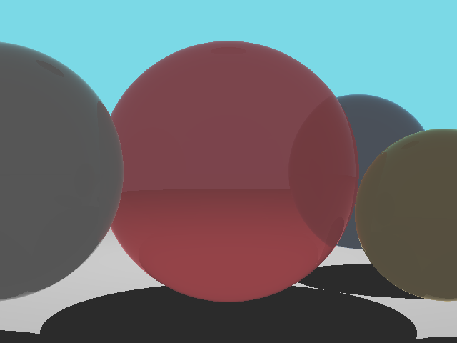
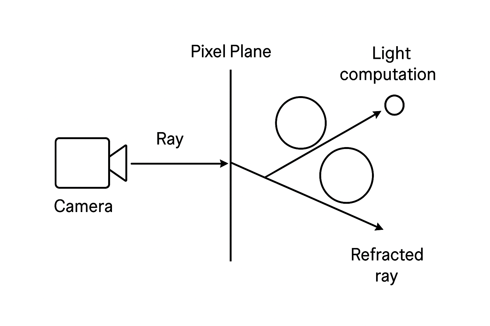

# Simple Ray Tracer in C++

A lightweight C++ ray tracing project demonstrating recursive reflections, refractions, shadows, and basic lighting with spheres.


*Rendered image of a sample scene with reflective and refractive spheres.*

## Table of Contents

* [Overview](#overview)
* [Features](#features)
* [Requirements](#requirements)
* [Installation](#installation)
* [Usage](#usage)
* [Code Structure](#code-structure)
* [Rendering Diagram](#rendering-diagram)
* [Sample Output](#sample-output)
* [License](#license)

## Overview

This project implements a **basic ray tracer** that generates a 3D scene composed of spheres. It demonstrates key ray tracing concepts:

* Diffuse shading with Lambertian reflection
* Shadows via shadow rays
* Recursive reflection and refraction
* Emissive light sources

The final output is a **PPM image** that can be converted to PNG or JPG for viewing.

## Features

* Recursive **reflection** and **refraction** with Fresnel effect
* **Diffuse shading** and **shadow casting**
* Spheres as **emissive lights**
* Adjustable **camera resolution** and **field of view**
* Gamma correction for realistic brightness

## Requirements

* C++11 or higher
* Standard C++ libraries: `<iostream>`, `<fstream>`, `<vector>`, `<cmath>`, `<limits>`, `<algorithm>`, `<chrono>`
* A C++ compiler (g++, clang++, or similar)

## Installation

1. Clone the repository:

```bash
git clone https://github.com/dhruvjindal007/Raytracing
cd raytracer_project
```

2. Compile the project:

```bash
g++ -std=c++11 -O2 raytracer.cpp -o raytracer
```

3. Run the executable:

```bash
./raytracer
```

4. The rendered image will be saved as `image.ppm`. Convert it to PNG/JPG if needed:

```bash
convert image.ppm image.png
```

## Usage

* Add, remove, or modify spheres in `main()`:

```cpp
spheres.emplace_back(Vec3(0, 0, -20), 4, Vec3(1.00, 0.32, 0.36), 1.0, 0.5);
```

* Adjust camera resolution and FOV in `render()`:

```cpp
const unsigned width = 640, height = 480;
const double fov = 30.0;
```

* Recompile and rerun to update the scene.

## Code Structure

* **Vec3** – 3D vector operations (dot, cross, normalize, length)
* **Ray** – Ray with origin and direction
* **Sphere** – Sphere object with color, reflection, transparency, and emission
* **trace()** – Recursive ray tracing handling intersections, reflections, refractions, shadows
* **render()** – Generates image by shooting rays from camera through each pixel
* **main()** – Scene setup and rendering execution

## Rendering Diagram

Below is a conceptual diagram illustrating how rays are traced from the camera through pixels, interact with objects, and produce reflections/refractions:

*Diagram shows primary rays from the camera, reflected and refracted rays, and shadows.*

## Sample Output

The sample scene contains:

* Ground plane (large sphere)
* Colored spheres with reflective/refractive properties
* Emissive light source (sphere)

**Output Image (image.ppm converted to PNG):**


## License

This project is licensed under **MIT License**. Free to use, modify, and distribute for learning purposes.